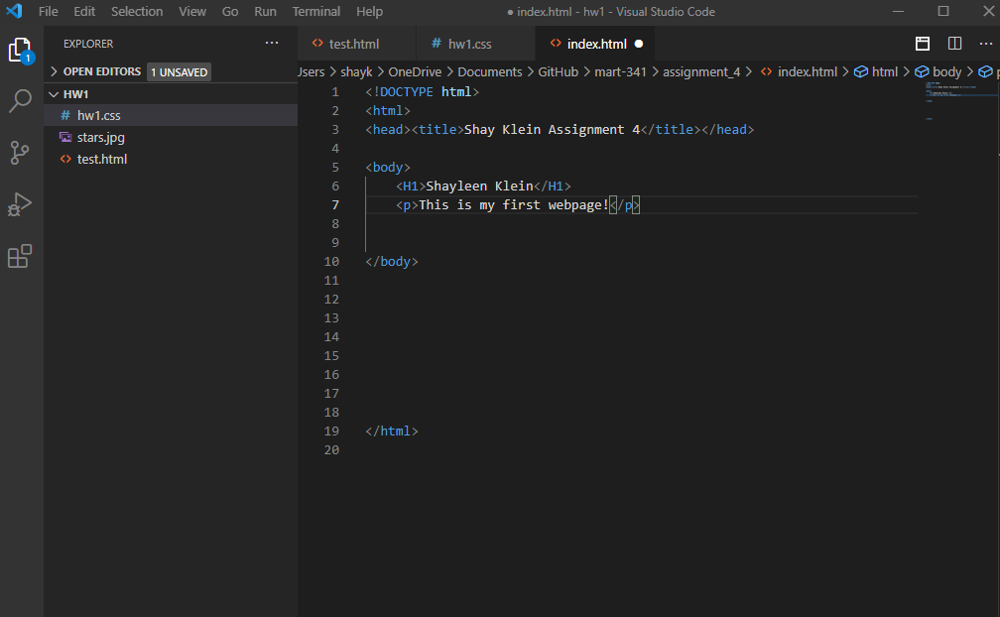

Browsers kind of act like your gateway to the online world- like glasses. Browsers I wouldn't say are the brains, more like the eyes.   

Markup, like 

 basically help the computer understand what you're going to tell it. Like telling the computer you're putting a paragraph here, instead of just regular words. 

